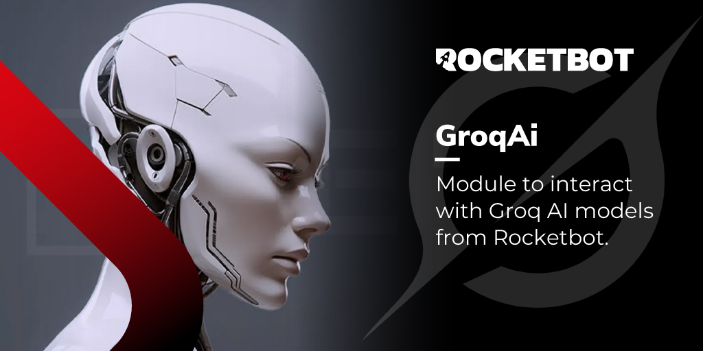

# Groq AI
  
Módulo para interactuar con los modelos de Groq AI desde Rocketbot.  

## Como instalar este módulo
  
Para instalar el módulo en Rocketbot Studio, se puede hacer de dos formas:
1. Manual: __Descargar__ el archivo .zip y descomprimirlo en la carpeta modules. El nombre de la carpeta debe ser el mismo al del módulo y dentro debe tener los siguientes archivos y carpetas: \__init__.py, package.json, docs, example y libs. Si tiene abierta la aplicación, refresca el navegador para poder utilizar el nuevo modulo.
2. Automática: Al ingresar a Rocketbot Studio sobre el margen derecho encontrara la sección de **Addons**, seleccionar **Install Mods**, buscar el modulo deseado y presionar install.  

## Cómo usar este módulo

Para usar este módulo, necesitamos obtener la clave API de Groq. Sigue estos pasos:

1. Para comenzar, cree una cuenta Groq o inicie sesión en [console.groq.com](https://console.groq.com/keys).

2. Una vez en la página de claves API, haga clic en el botón "Create API Key" para crear una nueva clave.

3. Se abrirá una ventana donde deberá:
   - Ingresar un nombre de referencia para la clave (máximo 50 caracteres)
   - Completar la validación de Cloudflare

4. Haga clic en el botón "Submit" para generar la clave.

5. La clave API se mostrará en pantalla. Utilice el botón "Copy" para copiarla.

**Importante**: Asegúrese de guardar la clave en un lugar seguro, ya que no podrá verla nuevamente después de cerrar esta ventana.
## Descripción de los comandos

### Conectar con groq
  
Establece conexión con Groq AI
|Parámetros|Descripción|ejemplo|
| --- | --- | --- |
|API Key|Clave API de tu cuenta de Groq AI|gsk_abc123...|
|Asignar a variable|Nombre de la variable donde se guardará la conexión|resultadoGroqAi|

### Obtener Modelos
  
Recupera los modelos disponibles de GroqAI
|Parámetros|Descripción|ejemplo|
| --- | --- | --- |
|Asignar a variable|Nombre de la variable donde se guardará la lista de modelos|resultadoModelos|

### Generar Texto
  
Genera texto utilizando GroqAI
|Parámetros|Descripción|ejemplo|
| --- | --- | --- |
|Prompt|Texto de entrada para generar texto|Qué es Rocketbot?|
|Modelo|ID del modelo a utilizar|compound-beta-mini|
|Temperatura (opcional)|Controla la aleatoriedad de la generación de texto (0.0 a 2)|0.8|
|Máximo de tokens (opcional)|Número máximo de tokens a generar|100|
|Secuencia de parada (opcional)|Secuencia opcional para detener la generación de texto|herramienta RPA|
|Asignar a variable|Nombre de la variable donde se guardará el texto generado|resultadoTexto|

### OCR a Imagen
  
Procesa una imagen con el OCR de GroqAI
|Parámetros|Descripción|ejemplo|
| --- | --- | --- |
|Modelo|Nombre del modelo OCR a utilizar|meta-llama/llama-4-scout-17b-16e-instruct|
|Archivo o URL|Permite subir un archivo local o ingresar una url hacia un archivo online|Ruta o URL del archivo|
|Mensaje (opcional)|Instrucción personalizada para el modelo sobre qué buscar o extraer de la imagen|Por favor, describe lo que ves en esta imagen.|
|Temperatura (opcional)|Valor entre 0 y 2. Valores más bajos son más precisos, valores más altos son más creativos. Por defecto 0.7|0.7|
|Asignar a variable|Nombre de la variable donde se guardará el resultado del OCR|resultadoOCR|

### Transcripción de Audio
  
Transcribe archivos de audio usando el servicio Speech-to-Text de GroqAI
|Parámetros|Descripción|ejemplo|
| --- | --- | --- |
|Modelo|ID del modelo a utilizar (por ejemplo whisper-large-v3)|whisper-large-v3|
|Archivo o URL|Ruta del archivo de audio o URL (formatos admitidos flac, mp3, mp4, mpeg, mpga, m4a, ogg, wav, webm)|Selecciona un archivo o pega una URL|
|Idioma (opcional)|Código ISO-639-1 del idioma (ej es, en, pt, pr)|es, en, pt, pr|
|Temperatura (opcional)|Valor entre 0 y 1 (default 0)|0.2|
|Asignar a variable|Nombre de la variable donde se guardará la transcripción|transcription|
